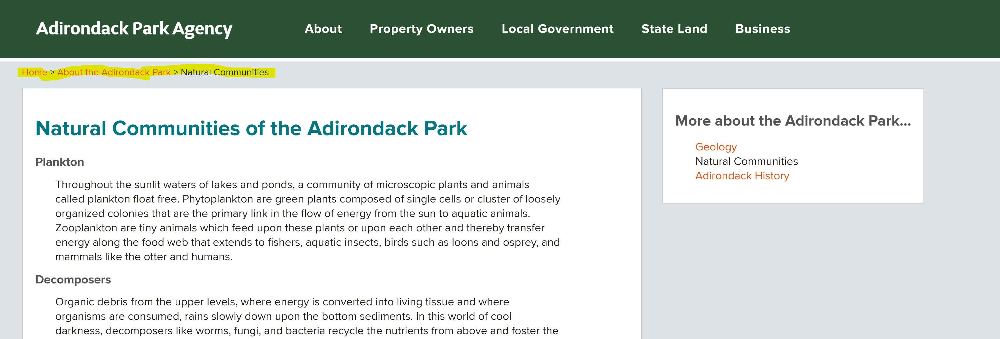

# (title of ur project)
## Charvi Nagpal DH110
### Assignment 01: Heuristic Evaluation of NY

---

This assignemnt seeks to heuristically evaluate two different government websites of New York State. The [10 Usability Heuristics for User Interface Design](https://www.nngroup.com/articles/ten-usability-heuristics/) are utilized to evaluate. 

The following severity rating scale will be used throughout the huersitic evalutaion. 
(1) Cosmetic problem only: need not be fixed unless extra time is available on project. 
(2) Minor usability problem: fixing this should be given low priority
(3) Major usability problem: important to fix, so should be given high priority

---

 ## [Adirondack Park Agency](https://apa.ny.gov/index.html) 
 
 
 ### Background Information
The Adirondack Park Agency (APA) was created in 1971 to develop long-range land use plans for both public and private lands within the boundary of the Park. This New York State government agency has 11 members on the board who meet monthyly to act on Park policy issues and permit applications. Their responsibilities also include maintaining the protection of the forest preserve, overseeing development proposals of the privately owned lands, and overall to protect the public and private resources of the Park. They offer jurisdictional and wetland advice to landowners and initiate permit applications. 

### Heuristic Evaluation
*Overall: The website is not tailored well for an average user. There are many issues that make it hard for users to navigate the site, namely that there isn't a seacrh bar so it can difficult to navigate the website. As well, it is hard to know where on the website a user is and it's diffuclt to know how to return. There is also quite a bit of visual clutter with some website inconsistencies.

**1. Visibility of system status** - The design should provide timely and appropriate feedback to always keep users informed about what is going on.

Users may have a hard time knowing where they are on the site. Some pages are only accessible by first clicking on other pages, but after jumping thrugh hurdles to get where one wants to be on the webiste, it is difficult to tell exactly where that is. There is a tiny bar that shows a user where they are, but it could be easily missed and it does not inform users on how to easily return to that page without having to click through other pages first. It is also innacraute to how users got to that page themselves at times. In other cases, clicking on a page may take you to a middle section of a bigger page. This also makes it difficult to know exactly where on the website you are. A solution might be to have more pages on the website that are accessible through the main menu and enlarging the bar that shows where on the website a user currently is. 

*Rating: 2* 

 

**2. Match between system and real world** - The website uses words, phrases, and concepts that are familiar to the user.
Most of the language used throughout the site is easy for a user to understand because it is aiming at being informative to the average person. For instance, the following page.  
> ["How Do You Protect the Forest Preserve?"](https://apa.ny.gov/State_Land/ProtectForest.htm) 
This is straightforward conceptually and uses easy to understand words and phrases. 

However, some more difficult to understand pages are also present on this website. This is mostly when it comes to pages that feature government documents that appear right next to more easily understood pages. For instance the following page. 
> ["Memorandum Of Understanding Between The Adirondack Park Agency And The Department Of Environmental Conservation Concerning Implementation Of The State Land Master Plan For The Adirondack Park"](https://apa.ny.gov/State_Land/2010-APA-DEC-MOU_June2018.pdf) 

This is probably not a document meant for everyone to read, but it would useful to have a explanation of this page in easy to understand language for the average user. 

*Rating: 1* 

**3. User control and freedom** - The website provdes the user with options, such as undo or redo
The website does a good job with user control, as users can press the back button on their laptop or mobile device to return to the page they were at prior. As well, there is a bar that shows users where they are in the website. This is a small bar that could benefit from being enlarged, but users can use it to return to any of the pages they clicked to get to where they are in the website. Clicking the name of the website "Adirondack Park Agency" at the top left also retruns users to the home page. 

*Rating: Not an Issue* 

**4. Consistency and standards** - The website has consistent design and usage across all pages of the website.
The color scheme is consistent with the same blue used for headings and orange for links. An issue here is that when the button on the menu for Property Owners is clicked, and then the an option on the drop down menu is clicked, the website takes users to a specific page. However when an option on the drop down menu for Local Government in clicked on the same menu, users are taken to a specific part of long webpage. It would be better to be consistent and have each option on the drop down menus lead to their own pages. 

*Rating: 2* 

**5. Error prevention** - The website provides safety nets for users and eliminates error-prone conditions. 
The website reduces user error by making all links bright orange. This way, it will be difficult for a user to make a mistake and acccidentally navigate to a page. It also informs users when a link leads to a pdf file so that users will not accidentally download anything they did not want to. With this website in particlar, there are not really any actions a user can take that cannot be undone, so error prevention does not have to be very strict. 

*Rating: Not an Issue* 

**6. Recognition rather than recall** - The website makes information needed to navigate the website, like elements, actions, and options, visible or easily accessible. 
It can be difficult to remember how to get to certain points in this website as there is a lot of information but unclear organization at times. Almost every page includes many links to other related topics, links that don't seem to appear anywhere else. Users must recall exaclty what pathway to follow to get to a specific page if they wish to retrun again. A solution to this may be to link to these pages more clearly in the menu, maybe with a larger drop down menu and more categories to choose from. 

*Rating: 3* 

**7.  Flexibility and efficiency of use** - The website allows frequent processes to be tailored to all users from novice to expert, like with shortcuts. 
The website seems mostly tailored to novices; there are no expert shortcuts. There simply do not appear to be many advanced options accessbile to experts. Every page seems to have additional links to "information you may find helpful" which is tailored to novices. A solution to this issue might be to implement a search bar so those that know what they need can find it directly without having to click through a bunch of pages. 

*Rating: 3* 

**8. Aesthetic and minimalist design** - The website's design is not cluttered and easily accessible.
The pages of the webiste are often busy with lots of text and not many images to break them up. The text is also often quite small and may be difficult for some users to read. Adding a larger font size and images would be a useful solution. Often there are so many links for additional information on the web pages; thehy should perhaps be streamlined a bit to reduce clutter on the website. 

*Rating: 2* 

**9. Help users recognize, diagnose, and recover from errors** - The website displays non-concerning error messages and constructively suggest a solution.
There are not many places that users can make errors on this website (at least I didn't find a way to create any kind of error message). This could be because there is no place for users to input their own information, like logging in, or search for anything. 

*Rating: Not an Issue* 

**10. Help and documentation** - The website has resources to help users understand how to complete tasks
The help section might be difficult for users to find as it not in the main menu at the top, but at the very bottom of the website. A solution could be to make it more visible by including a Help button in the main menu. Asides from this, the help section is simple to understand. There are plenty of FAQs and if this isn't helpful enough, there is a phone number available to call for additional support. 

*Rating: 1* 

---

## 

