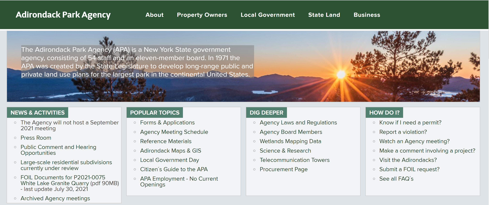
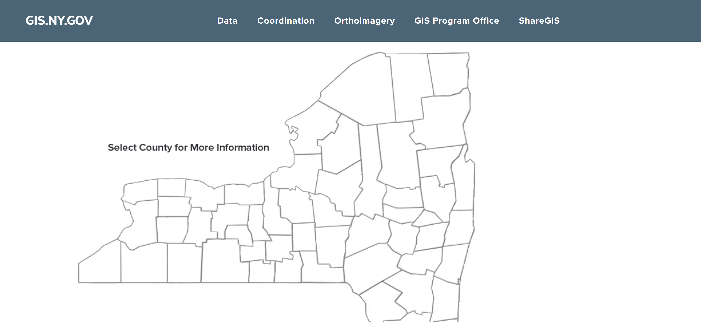
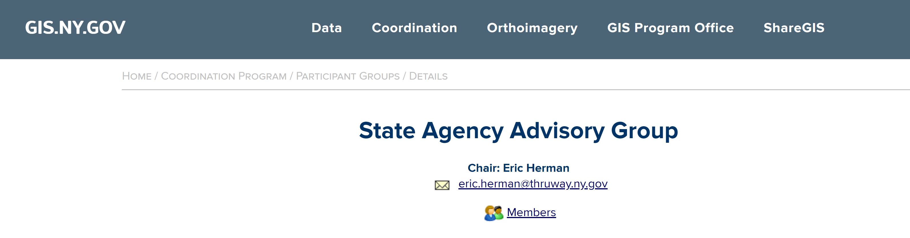
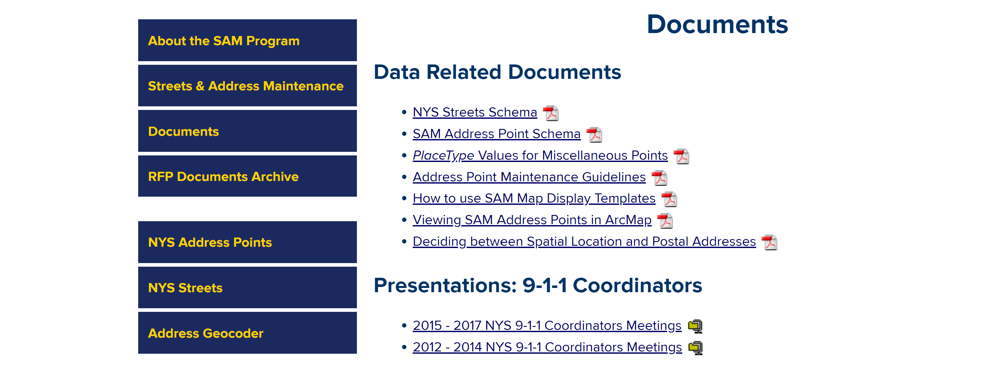

#  Heuristic Evaluation of NY
## Charvi Nagpal DH110
### Assignment 01
---

This assignemnt seeks to heuristically evaluate two different government websites of New York State. I have chosen to focus on websites that relate to New York's land. Specifically, the [Adirondack Park Agency](https://apa.ny.gov/index.html) and the [Geographic Information Systems Clearinghouse](http://gis.ny.gov/). The [10 Usability Heuristics for User Interface Design](https://www.nngroup.com/articles/ten-usability-heuristics/) are utilized to evaluate. 

The following severity rating scale will be used throughout the huersitic evalutaion. 
(1) Cosmetic problem only: need not be fixed unless extra time is available on project. 
(2) Minor usability problem: fixing this should be given low priority
(3) Major usability problem: important to fix, so should be given high priority. 

---

 ## [Adirondack Park Agency](https://apa.ny.gov/index.html) 
 
 
 ### Background Information
The Adirondack Park Agency (APA) was created in 1971 to develop long-range land use plans for both public and private lands within the boundary of the Park. This New York State government agency has 11 members on the board who meet monthyly to act on Park policy issues and permit applications. Their responsibilities also include maintaining the protection of the forest preserve, overseeing development proposals of the privately owned lands, and overall to protect the public and private resources of the Park. They offer jurisdictional and wetland advice to landowners and initiate permit applications. 

### Heuristic Evaluation
*Overall: The website is not tailored well for an average user. There are many issues that make it hard for users to navigate the site, namely that there isn't a seacrh bar so it can difficult to navigate the website. As well, it is hard to know where on the website a user is and it's diffuclt to know how to return. There is also quite a bit of visual clutter with some website inconsistencies.

**1. Visibility of system status** - The design should provide timely and appropriate feedback to always keep users informed about what is going on.

Users may have a hard time knowing where they are on the site. Some pages are only accessible by first clicking on other pages, but after jumping thrugh hurdles to get where one wants to be on the webiste, it is difficult to tell exactly where that is. There is a tiny bar that shows a user where they are, but it could be easily missed and it does not inform users on how to easily return to that page without having to click through other pages first. It is also innacraute to how users got to that page themselves at times. In other cases, clicking on a page may take you to a middle section of a bigger page. This also makes it difficult to know exactly where on the website you are. A solution might be to have more pages on the website that are accessible through the main menu and enlarging the bar that shows where on the website a user currently is. 

*Rating: 2* 

 

**2. Match between system and real world** - The website uses words, phrases, and concepts that are familiar to the user.

Most of the language used throughout the site is easy for a user to understand because it is aiming at being informative to the average person. For instance, the following page.  
> ["How Do You Protect the Forest Preserve?"](https://apa.ny.gov/State_Land/ProtectForest.htm) 
This is straightforward conceptually and uses easy to understand words and phrases. 

However, some more difficult to understand pages are also present on this website. This is mostly when it comes to pages that feature government documents that appear right next to more easily understood pages. For instance the following page. 
> ["Memorandum Of Understanding Between The Adirondack Park Agency And The Department Of Environmental Conservation Concerning Implementation Of The State Land Master Plan For The Adirondack Park"](https://apa.ny.gov/State_Land/2010-APA-DEC-MOU_June2018.pdf) 

This is probably not a document meant for everyone to read, but it would useful to have a explanation of this page in easy to understand language for the average user. 

*Rating: 1* 

**3. User control and freedom** - The website provdes the user with options, such as undo or redo

The website does a good job with user control, as users can press the back button on their laptop or mobile device to return to the page they were at prior. As well, there is a bar that shows users where they are in the website. This is a small bar that could benefit from being enlarged, but users can use it to return to any of the pages they clicked to get to where they are in the website. Clicking the name of the website "Adirondack Park Agency" at the top left also retruns users to the home page. 

*Rating: 1* 

**4. Consistency and standards** - The website has consistent design and usage across all pages of the website.

The color scheme is consistent with the same blue used for headings and orange for links. An issue here is that when the button on the menu for Property Owners is clicked, and then the an option on the drop down menu is clicked, the website takes users to a specific page. However when an option on the drop down menu for Local Government in clicked on the same menu, users are taken to a specific part of long webpage. It would be better to be consistent and have each option on the drop down menus lead to their own pages. 

*Rating: 2* 

**5. Error prevention** - The website provides safety nets for users and eliminates error-prone conditions. 

The website reduces user error by making all links bright orange. This way, it will be difficult for a user to make a mistake and acccidentally navigate to a page. An improvement could be to include a pop up when a user naviagtes away from the website altogether. It also informs users when a link leads to a pdf file so that users will not accidentally download anything they did not want to. With this website in particlar, there are not really any actions a user can take that cannot be undone, so error prevention does not have to be very strict. 

*Rating: Not an Issue* 

**6. Recognition rather than recall** - The website makes information needed to navigate the website, like elements, actions, and options, visible or easily accessible.

It can be difficult to remember how to get to certain points in this website as there is a lot of information but unclear organization at times. Almost every page includes many links to other related topics, links that don't seem to appear anywhere else. Users must recall exaclty what pathway to follow to get to a specific page if they wish to retrun again. A solution to this may be to link to these pages more clearly in the menu, maybe with a larger drop down menu and more categories to choose from. 

*Rating: 3* 

**7.  Flexibility and efficiency of use** - The website allows frequent processes to be tailored to all users from novice to expert, like with shortcuts. 

The website seems mostly tailored to novices; there are no expert shortcuts. There simply do not appear to be many advanced options accessbile to experts. Every page seems to have additional links to "information you may find helpful" which is tailored to novices. A solution to this issue might be to implement a search bar so those that know what they need can find it directly without having to click through a bunch of pages. 

*Rating: 3* 

**8. Aesthetic and minimalist design** - The website's design is not cluttered and easily accessible.

The pages of the webiste are often busy with lots of text and not many images to break them up. The text is also often quite small and may be difficult for some users to read. Adding a larger font size and images would be a useful solution. Often there are so many links for additional information on the web pages; thehy should perhaps be streamlined a bit to reduce clutter on the website. 

*Rating: 2* 

**9. Help users recognize, diagnose, and recover from errors** - The website displays non-concerning error messages and constructively suggest a solution.

There are not many places that users can make errors on this website (at least I didn't find a way to create any kind of error message). This could be because there is no place for users to input their own information, like logging in, or search for anything. 

*Rating: Not an Issue* 

**10. Help and documentation** - The website has resources to help users understand how to complete tasks.

The help section might be difficult for users to find as it not in the main menu at the top, but at the very bottom of the website. A solution could be to make it more visible by including a Help button in the main menu. Asides from this, the help section is simple to understand. There are plenty of FAQs and if this isn't helpful enough, there is a phone number available to call for additional support. 

*Rating: 1* 

---

## [Geographic Information Systems Clearinghouse](http://gis.ny.gov/)

### Background Information
This Clearinghouse, an agency that collects and distributes information, disseminates information about New York's Statewide GIS Coordination Program and provides access to the New York State GIS Data and Metadata Repository. Users can browse the list of  GIS data sets, or search for specific keywords, to find out what data is available, who holds it, and how it can be obtained. 

### Heuristic Evaluation
*Overall: *

**1. Visibility of system status** - The design should provide timely and appropriate feedback to always keep users informed about what is going on.

It isn't very obvious what page a user is on. There is a small bar showing the category you are under, but it is inconsistent. Sometimes it shows pages that weren't clicked on to get to the page the user is at. Sometimes it disregards certain pages that were clicked on altogether and just shows the page the user is currently on. In the image below, this top bar does not even display the accurate title of the page. This bar is also made up of text that is very small and almost translucent, making it difficult to read. It would be helpful to make the bar display accurate information and be darker in color with  bigger text to be more obviously visible. 

*Rating: 3* 

**2. Match between system and real world** - The website uses words, phrases, and concepts that are familiar to the user.

Some of the terminology used in this website may be unfamiliar to users not experienced with GIS. However, this may not be the website's target demographic so this may not need to change. For instance:
>"Raster Maps"

> "Orthoimagery"

There is probably no simpler way to put these technical terms, but perhaps a small solution could be to add an explanation/summary to the page once a user clicks on these items. 

In addition, the wesbite's title is simply "GIS.NY.GOV." This acronym could quite confusing to new users, it should be corrected to the full name **Geographic Information Systems Clearinghouse**. 

*Rating: 2* 

**3. User control and freedom** - The website provdes the user with options, such as undo or redo. 

Since the bar at the top of the page often does not accurately display the pathway users took to get to the current page, it is difficult to undo actions. Going back to a page a user was previously on can be hard. Of course, a user's computer or phone could perform this task as well, so the problem is not as severe. A solution would be to correct the bar at the top of the page. 

*Rating: 1* 

**4. Consistency and standards** - The website has consistent design and usage across all pages of the website.

As previously mentioned, the bar at the top of the page is not consistent with how it displays a user's path to the current page, so this should be corrected. The font, text size, and color scheme is all consistent throughout the site. In addition, some menu items have drop down menus while others don't (but could use a drop down menu). This is inconsistent, but could be solved by making sure all the menu items have a small drop down menu. Asides from this, the design of the website sems very consistent with itself and with other government websites. It is simple, with easy to read text and basic colors. 

*Rating: 2* 

**5. Error prevention** - The website provides safety nets for users and eliminates error-prone conditions. 

This website prevents user errors by providing a small image next to pdf and zip files that indicate to the user what they will be downloading if they click the link.  However, this isn't as intuitive as it could be. In fact, I didn't know what a zip file's symbol was and I had to click the link and download the file to figure it out. A solution could be to include a small caption that tells users the file type. Any links are also underlined, but this isn't very obvious to users. It might be beneficial for links to also be a different color. In addition, the website does a good job preventing search errors. Because the search feature doesn't take in any text from users and instead allowes users to simply select the owner of the data set and theme of the data set, the ability for error to occur decreases.

*Rating: 1* 

**6. Recognition rather than recall** - The website makes information needed to navigate the website, like elements, actions, and options, visible or easily accessible. 

Rather than making the search bar easy to recognize, it is buried within the site for users to find. Users must click on the "Data" button on the menu, then click "Data Catalog" in the drop down menu. Only then can the user search the GIS data set inventories by owner or theme. A solution to this issue would be to give the search function its own spot on the menu. In addition, even after clicking an option from the menu and then the drop down menu, there are still a lot of options to click that show up in the side bar. This forces the user to recall the organization of the site, but could be solved by consolidating some of these additional options, or putting some on the same page.

*Rating: 3* 

**7.  Flexibility and efficiency of use** - The website allows frequent processes to be tailored to all users from novice to expert, like with shortcuts. 

Instead of hiding an expert level shortcut from users, this website features it on ts homepage. If a user clicks on the webste title, they are taken to the homepage where a map of New York's counties is present, without any labeling. A text box asks users to select a county for more information. Though this is a useful feature, not everyone can recognize New York's counties without any help. The map lacks accessibility for novices that cannot recognize these counties. A solution may be to place this feature elsewhere on the website and include labels for the counties to make it more accessible. 

*Rating: 2* 

**8. Aesthetic and minimalist design** - The website's design is not cluttered and easily accessible.

This website is not very cluttered with excess links. In addition, the text size, color, and font are easily reabable. 

*Rating: Not an Issue* 

**9. Help users recognize, diagnose, and recover from errors** - The website displays non-concerning error messages and constructively suggest a solution.

There are not many places that users can make errors on this website. The search feature only allows for users to select data owner and data theme, and the only kind of error I was able to produce with this was the following: 

>No Matching Records Found.
>
>Your search criteria may have been too narrow.
>
>Refine Your Search

This is a very clear error message that lets the user know exactly what went wrong and supplies them with a link to try their search again. 

*Rating: Not an Issue* 

**10. Help and documentation** - The website has resources to help users understand how to complete tasks. 

There is no part of the website that is distnictly labelled as a "help" page, which could be confusing for users. There is a "Contact" page that allows users to direct their questions to a certain email and phone number. However, the site could benfit from adding a dedictaed help page that includes the answers to freuently asked questions. 

*Rating: 3* 

---

